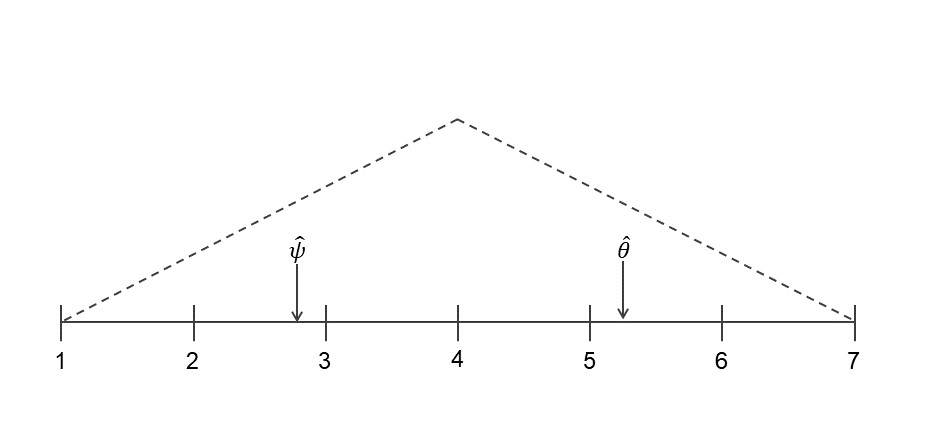

\newpage 
\tableofcontents 
\listoffigures
\listoftables
\newpage

```{r setup, include=FALSE}
rm(list = ls())

# The first line sets an option for the final document that can be produced from
# the .Rmd file. Don't worry about it.
knitr::opts_chunk$set(echo = TRUE)

# The next bit is quite powerful and useful.
# First you define which packages you need for your analysis and assign it to
# the p_needed object.
p_needed <-
  c("foreign",
    "viridis",
    "MASS",
    "optimx",
    "separationplot",
    "knitr",
    "stargazer")

# Now you check which packages are already installed on your computer.
# The function installed.packages() returns a vector with all the installed
# packages.
packages <- rownames(installed.packages())
# Then you check which of the packages you need are not installed on your
# computer yet. Essentially you compare the vector p_needed with the vector
# packages. The result of this comparison is assigned to p_to_install.
p_to_install <- p_needed[!(p_needed %in% packages)]
# If at least one element is in p_to_install you then install those missing
# packages.
if (length(p_to_install) > 0) {
  install.packages(p_to_install)
}
# Now that all packages are installed on the computer, you can load them for
# this project. Additionally the expression returns whether the packages were
# successfully loaded.
sapply(p_needed, require, character.only = TRUE)

# This is an option for stargazer tables
# It automatically adapts the output to html or latex,
# depending on whether we want a html or pdf file
stargazer_opt <- ifelse(knitr::is_latex_output(), "latex", "html")


set.seed(21122020)
```


```{r,  include=FALSE}
data <- read.dta("data/anes08_data_essay.dta")

vars <- c(1, 3, 8:15)

df <- data[complete.cases(data[, vars]), ]


independents_hi <-
  df[which(df$party_id == "Independent" & df$pol_knowledge == 1),]

mode <- function(x) {
  ux <- unique(x)
  ux[which.max(tabulate(match(x, ux)))]
}
```


```{r pressure, echo=FALSE, fig.cap="A caption", out.width = '100%'}

```


```{r density, echo = FALSE, dpi=300, fig.width=9, fig.height=7, out.width='75%', fig.align='center', fig.cap='FDs'}


a <- density(df$lib_con_self[which(df$party_id == "Democrat")])
b <- density(df$lib_con_self[which(df$party_id == "Independent")])
c <- density(df$lib_con_self[which(df$party_id == "Republican")])

plot(
  a$x,
  a$y,
  xlab = "Liberal-Conservative Location of Voter",
  ylab = "Voter Density",
  ylim = c(min(c$y), max(c$y)),
  xlim = c(1, 7),
  col = "black",
  type = "l",
  lty = 1,
  lwd = 3,
  bty = "n",
  yaxt = "n"
)

lines(b$x,
      b$y,
      col = "black",
      lty = 2,
      lwd = 3)

lines(c$x,
      c$y,
      col = "black",
      lty = 3,
      lwd = 3)

legend(
  "topright",
  legend = c("Democrat", "Independent", "Republican"),
  col = "black",
  lty = 1:3,
  cex = 0.8
)

```

```{r propvoting, echo = FALSE, dpi=300, fig.width=9, fig.height=7, out.width='75%', fig.align='center', fig.cap='FDs'}

props_dem <-
  as.data.frame(prop.table(table(df$lib_con_self[which(df$party_id == "Democrat")], df$obama[which(df$party_id ==
                                                                                                     "Democrat")])))
props_dem <- props_dem[which(props_dem$Var2 == 1), ]

props_ind <-
  as.data.frame(prop.table(table(df$lib_con_self[which(df$party_id == "Independent")], df$obama[which(df$party_id ==
                                                                                                        "Independent")])))
props_ind <- props_ind[which(props_ind$Var2 == 1), ]

props_rep <-
  as.data.frame(prop.table(table(df$lib_con_self[which(df$party_id == "Republican")], df$obama[which(df$party_id ==
                                                                                                       "Republican")])))
props_rep <- props_rep[which(props_rep$Var2 == 1), ]


plot(
  c(1, 7),
  ylim = c(0, 0.5),
  xlim = c(1, 7),
  type = "n",
  ylab = "Proportion Voting for Obama",
  xlab = "Liberal-Conservative Location of Voter",
  bty = "n",
  las = 1
)


lines(
  props_dem$Var1,
  props_dem$Freq,
  col = "black",
  lty = 1,
  lwd = 3
)

lines(
  props_ind$Var1,
  props_ind$Freq,
  col = "black",
  lty = 2,
  lwd = 3
)

lines(
  props_rep$Var1,
  props_rep$Freq,
  col = "black",
  lty = 3,
  lwd = 3
)

legend(
  "topright",
  legend = c("Democrat", "Independent", "Republican"),
  col = "black",
  lty = 1:3,
  cex = 0.8
)


```


```{r,  include=FALSE}
m1 <-
  glm(
    obama ~ lib_con_self * party_id + race + male + age + relig_denomination + above_median_inc + college_degree,
    data = df,
    family = binomial(link = logit)
  )
summary(m1)


# 1. get the coefficients
beta_hat <- coef(m1)

# 2. Get the variance-covariance matrix
V_hat <- vcov(m1)

# 3. Set up a multivariate normal distribution N(beta_hat, V_hat)
# 4. Draw from the distribution nsim times
nsim <- 10000
S <- mvrnorm(n = nsim, 
             mu = beta_hat, 
             Sigma = V_hat)
head(S)

# we simulate over a sequence of x-values
lr_seq <- seq(min(df$lib_con_self, na.rm=T), max(df$lib_con_self, na.rm=T), length.out = 100)

# lr_seq <- seq(1,7,length.out = 7)
# What about the other covariates? Following average case practice, we take the 
# mode for dummy variables and rounding to the nearest whole number for categorical variables:


# Democrats 
scenario_dem <- cbind(1, # Intercept
                  lr_seq, # LR Scale
                  0, # Party ID = Independent
                  0, # Party ID = Republican
                  0, # Race = Black
                  0, # Race = Other/Mixed
                  0, # Gender = Male
                  mean(df$age, na.rm=T), # Age
                  1, # Religion = Protestant
                  0, # Religion = Catholic
                  0, # Religion = Other
                  0, # Above Median Income
                  0, # College Degree
                  0, # LR Scale*Independent
                  0  # LR Scale*Republican
                  )


Xbeta_dem <- S %*% t(scenario_dem)

p_sim_dem <- (exp(Xbeta_dem)) / (1 + exp(Xbeta_dem))

p_mean_dem <- apply(p_sim_dem, 2, mean)
p_qu_dem <- t(apply(p_sim_dem, 2, quantile, prob = c(0.025, 0.975)))

# Independents 
scenario_ind <- cbind(1, # Intercept
                  lr_seq, # LR Scale
                  1, # Party ID = Independent
                  0, # Party ID = Republican
                  0, # Race = Black
                  0, # Race = Other/Mixed
                  0, # Gender = Male
                  mean(df$age, na.rm=T), # Age
                  1, # Religion = Protestant
                  0, # Religion = Catholic
                  0, # Religion = Other
                  0, # Above Median Income
                  0, # College Degree
                  lr_seq*1, # LR Scale*Independent
                  0  # LR Scale*Republican
                  )

Xbeta_ind <- S %*% t(scenario_ind)

p_sim_ind <- (exp(Xbeta_ind)) / (1 + exp(Xbeta_ind))

p_mean_ind <- apply(p_sim_ind, 2, mean)
p_qu_ind <- t(apply(p_sim_ind, 2, quantile, prob = c(0.025, 0.975)))

# Republicans 
scenario_rep <- cbind(1, # Intercept
                  lr_seq, # LR Scale
                  0, # Party ID = Independent
                  1, # Party ID = Republican
                  0, # Race = Black
                  0, # Race = Other/Mixed
                  0, # Gender = Male
                  mean(df$age, na.rm=T), # Age
                  1, # Religion = Protestant
                  0, # Religion = Catholic
                  0, # Religion = Other
                  0, # Above Median Income
                  0, # College Degree
                  0, # LR Scale*Independent
                  lr_seq*1  # LR Scale*Republican
                  )


Xbeta_rep <- S %*% t(scenario_rep)

p_sim_rep <- (exp(Xbeta_rep)) / (1 + exp(Xbeta_rep))

p_mean_rep <- apply(p_sim_rep, 2, mean)
p_qu_rep <- t(apply(p_sim_rep, 2, quantile, prob = c(0.025, 0.975)))


```


```{r evpartyid, echo = FALSE, dpi=300, fig.width=7, fig.height=7, out.width='75%', fig.align='center', fig.cap='Cap'}

plot(
  x = lr_seq,
  y = p_mean_dem,
  ylim = c(0, 1),
  type = "n",
  main = "Party Identification and Spatial Voting",
  ylab = "Probability of Voting for Obama",
  xlab = "Liberal-Conservative Location of Voter",
  bty = "n",
  las = 1
)

# Democrats

# plot uncertainty with a polygon
polygon(
  x = c(rev(lr_seq), lr_seq),
  y = c(rev(p_qu_dem[, 2]), p_qu_dem[, 1]),
  col = adjustcolor("black", alpha = 0.1),
  border = NA
)

# and a line
lines(x = lr_seq,
      y = p_mean_dem,
      lwd = 3,
      lty = 1)

# Independents

# plot uncertainty with a polygon
polygon(
  x = c(rev(lr_seq), lr_seq),
  y = c(rev(p_qu_ind[, 2]), p_qu_ind[, 1]),
  col = adjustcolor("black", alpha = 0.1),
  border = NA
)

# and a line
lines(x = lr_seq,
      y = p_mean_ind,
      lwd = 3,
      lty = 2)


# Republicans

# plot uncertainty with a polygon
polygon(
  x = c(rev(lr_seq), lr_seq),
  y = c(rev(p_qu_rep[, 2]), p_qu_rep[, 1]),
  col = adjustcolor("black", alpha = 0.1),
  border = NA
)

# and a line
lines(x = lr_seq,
      y = p_mean_rep,
      lwd = 3,
      lty = 3)


legend(
  "bottomleft",
  legend = c("Democrat", "Independent", "Republican"),
  col = c("black", "black", "black"),
  lty = 1:3,
  cex = 0.8,
  pt.lwd = 2
)

abline(
  h = 0.5,
  col = adjustcolor("red", alpha = 0.5),
  lty = 1,
  lwd = 3
) 

```


```{r,  include=FALSE}

obama_position <- 2.83
mccain_position <- 5.28

# Democrats

scenario_dem_1 <- cbind(1, # Intercept
                  obama_position, # LR Scale
                  0, # Party ID = Independent
                  0, # Party ID = Republican
                  0, # Race = Black
                  0, # Race = Other/Mixed
                  0, # Gender = Male
                  mean(df$age, na.rm=T), # Age
                  1, # Religion = Protestant
                  0, # Religion = Catholic
                  0, # Religion = Other
                  0, # Above Median Income
                  0, # College Degree
                  0, # LR Scale*Independent
                  0  # LR Scale*Republican
                  )


Xbeta_dem_1 <- S %*% t(scenario_dem_1)

p_sim_dem_1 <- (exp(Xbeta_dem_1))/ (1 + exp(Xbeta_dem_1))

p_mean_dem_1 <- apply(p_sim_dem_1, 2, mean)
p_qu_dem_1 <- t(apply(p_sim_dem_1, 2, quantile, prob = c(0.025, 0.975)))


scenario_dem_2 <- cbind(1, # Intercept
                  mccain_position, # LR Scale
                  0, # Party ID = Independent
                  0, # Party ID = Republican
                  0, # Race = Black
                  0, # Race = Other/Mixed
                  0, # Gender = Male
                  mean(df$age, na.rm=T), # Age
                  1, # Religion = Protestant
                  0, # Religion = Catholic
                  0, # Religion = Other
                  0, # Above Median Income
                  0, # College Degree
                  0, # LR Scale*Independent
                  0  # LR Scale*Republican
                  )

Xbeta_dem_2 <- S %*% t(scenario_dem_2)

p_sim_dem_2 <- (exp(Xbeta_dem_2))/ (1 + exp(Xbeta_dem_2))

p_mean_dem_2 <- apply(p_sim_dem_2, 2, mean)
p_qu_dem_2 <- t(apply(p_sim_dem_2, 2, quantile, prob = c(0.025, 0.975)))


fd_dem <- p_sim_dem_1 - p_sim_dem_2
fd_mean_dem <- apply(fd_dem, 2, mean)
fd_qu_dem <- t(apply(fd_dem, 2, quantile, prob = c(0.025, 0.975)))

# Independents

scenario_ind_1 <- cbind(1, # Intercept
                  obama_position, # LR Scale
                  1, # Party ID = Independent
                  0, # Party ID = Republican
                  0, # Race = Black
                  0, # Race = Other/Mixed
                  0, # Gender = Male
                  mean(df$age, na.rm=T), # Age
                  1, # Religion = Protestant
                  0, # Religion = Catholic
                  0, # Religion = Other
                  0, # Above Median Income
                  0, # College Degree
                  obama_position*1, # LR Scale*Independent
                  0  # LR Scale*Republican
                  )

Xbeta_ind_1 <- S %*% t(scenario_ind_1)

p_sim_ind_1 <- (exp(Xbeta_ind_1))/ (1 + exp(Xbeta_ind_1))

p_mean_ind_1 <- apply(p_sim_ind_1, 2, mean)
p_qu_ind_1 <- t(apply(p_sim_ind_1, 2, quantile, prob = c(0.025, 0.975)))


scenario_ind_2 <- cbind(1, # Intercept
                  mccain_position, # LR Scale
                  1, # Party ID = Independent
                  0, # Party ID = Republican
                  0, # Race = Black
                  0, # Race = Other/Mixed
                  0, # Gender = Male
                  mean(df$age, na.rm=T), # Age
                  1, # Religion = Protestant
                  0, # Religion = Catholic
                  0, # Religion = Other
                  0, # Above Median Income
                  0, # College Degree
                  mccain_position*1, # LR Scale*Independent
                  0  # LR Scale*Republican
                  )

Xbeta_ind_2 <- S %*% t(scenario_ind_2)

p_sim_ind_2 <- (exp(Xbeta_ind_2))/ (1 + exp(Xbeta_ind_2))

p_mean_ind_2 <- apply(p_sim_ind_2, 2, mean)
p_qu_ind_2 <- t(apply(p_sim_ind_2, 2, quantile, prob = c(0.025, 0.975)))

fd_ind <- p_sim_ind_1 - p_sim_ind_2
fd_mean_ind <- apply(fd_ind, 2, mean)
fd_qu_ind <- t(apply(fd_ind, 2, quantile, prob = c(0.025, 0.975)))


# Republicans

scenario_rep_1 <- cbind(1, # Intercept
                  obama_position, # LR Scale
                  0, # Party ID = Independent
                  1, # Party ID = Republican
                  0, # Race = Black
                  0, # Race = Other/Mixed
                  0, # Gender = Male
                  mean(df$age, na.rm=T), # Age
                  1, # Religion = Protestant
                  0, # Religion = Catholic
                  0, # Religion = Other
                  0, # Above Median Income
                  0, # College Degree
                  0, # LR Scale*Independent
                  obama_position*1  # LR Scale*Republican
                  )


Xbeta_rep_1 <- S %*% t(scenario_rep_1)

p_sim_rep_1 <- (exp(Xbeta_rep_1))/ (1 + exp(Xbeta_rep_1))

p_mean_rep_1 <- apply(p_sim_rep_1, 2, mean)
p_qu_rep_1 <- t(apply(p_sim_rep_1, 2, quantile, prob = c(0.025, 0.975)))


scenario_rep_2 <- cbind(1, # Intercept
                  mccain_position, # LR Scale
                  0, # Party ID = Independent
                  1, # Party ID = Republican
                  0, # Race = Black
                  0, # Race = Other/Mixed
                  0, # Gender = Male
                  mean(df$age, na.rm=T), # Age
                  1, # Religion = Protestant
                  0, # Religion = Catholic
                  0, # Religion = Other
                  0, # Above Median Income
                  0, # College Degree
                  0, # LR Scale*Independent
                  mccain_position*1  # LR Scale*Republican
                  )

Xbeta_rep_2 <- S %*% t(scenario_rep_2)

p_sim_rep_2 <- (exp(Xbeta_rep_2))/ (1 + exp(Xbeta_rep_2))

p_mean_rep_2 <- apply(p_sim_rep_2, 2, mean)
p_qu_rep_2 <- t(apply(p_sim_rep_2, 2, quantile, prob = c(0.025, 0.975)))

fd_rep <- p_sim_rep_1 - p_sim_rep_2
fd_mean_rep <- apply(fd_rep, 2, mean)
fd_qu_rep <- t(apply(fd_rep, 2, quantile, prob = c(0.025, 0.975)))

fds <- rbind(fd_mean_dem,fd_mean_ind, fd_mean_rep)
cis <- rbind(fd_qu_dem,fd_qu_ind, fd_qu_rep)


```

```{r, echo = FALSE, dpi=300, fig.width=7, fig.height=3.5, out.width='100%', fig.align='center', fig.cap='FDs'}


# Plot
plot(
  cis,
  xlim = c(0.5, 3.5),
  ylim = c(0, 0.5),
  type = "n",
  xlab = "",
  xaxt = "n",
  ylab = "First Difference",
  bty = "n",
  main = "FDs"
)

axis(1,
     at = 1:3,
     labels = c("Democrat", "Independent", "Republican"))

abline(h = 0,
       col = "#eea1a1",
       lty = 1,
       lwd = 3)

# Now we add the confidence intervals from our 100 regressions on different samples.
col <- c("black", "#989898", "#cccccc")

for (i in 1:3) {
  segments(i, cis[i, 1], i, cis[i, 2], col = col[i], lwd = 4)
  points(
    i,
    fds[i],
    pch = 19,
    cex = 1,
    lwd = 4,
    col = col[i]
  )
}


```

```{r,  include=FALSE}


m2 <-
  glm(obama ~ lib_con_self * party_id,
      data = df,
      family = binomial(link = logit))
summary(m2)


```

```{r twoplots, echo = FALSE, dpi=300, fig.width=7, fig.height=3.5, out.width='100%', fig.align='center', fig.cap='Model fit'}

par(mfrow = c(1, 2),
    mar = c(0, 0, 0, 0) + 0.1) 

separationplot(
  pred = m2$fitted,
  actual = df$obama,
  line = TRUE,
  heading = "Separation Plot",
  show.expected = T,
  col0 = "#cccccc",
  col1 = "#989898",
  lwd2 = 2,
  height = 2,
  newplot = F
)

separationplot(
  pred = m1$fitted,
  actual = df$obama,
  line = TRUE,
  heading = "Separation Plot",
  show.expected = T,
  col0 = "#cccccc",
  col1 = "#989898",
  lwd2 = 2,
  height = 2,
  newplot = F
)

```


```{r,  include=FALSE}


m3 <-
  glm(
    obama ~ lib_con_self + race + male + age + relig_denomination + above_median_inc + college_degree,
    data = independents_hi,
    family = binomial(link = logit)
  )
summary(m3)


# 1. get the coefficients
beta_hat <- coef(m3)

# 2. Get the variance-covariance matrix
V_hat <- vcov(m3)

# 3. Set up a multivariate normal distribution N(beta_hat, V_hat)
# 4. Draw from the distribution nsim times
nsim <- 10000
S <- mvrnorm(n = nsim, 
             mu = beta_hat, 
             Sigma = V_hat)
head(S)

# we simulate over a sequence of x-values
lr_seq2 <- seq(1, 7, by = 0.001)

# lr_seq <- seq(1,7,length.out = 7)
# What about the other covariates? Following average case practice, we take the 
# mode for dummy variables and rounding to the nearest whole number for categorical variables:


# Scenario 
scenario_ind_hi <- cbind(1, # Intercept
                  lr_seq2, # LR Scale
                  0, # Race = Black
                  0, # Race = Other/Mixed
                  1, # Gender = Male
                  mean(independents_hi$age, na.rm=T), # Age
                  1, # Religion = Protestant
                  0, # Religion = Catholic
                  0, # Religion = Other
                  1, # Above Median Income
                  0 # College Degree
                  )

Xbeta_ind_hi <- S %*% t(scenario_ind_hi)

p_sim_ind_hi <- (exp(Xbeta_ind_hi))/ (1 + exp(Xbeta_ind_hi))

p_mean_ind_hi <- apply(p_sim_ind_hi, 2, mean)
p_qu_ind_hi <- t(apply(p_sim_ind_hi, 2, quantile, prob = c(0.025, 0.975)))

props_ind_hi <- as.data.frame(cbind(p_mean_ind_hi,lr_seq2))
props_ind_hi$dist <- abs(props_ind_hi$p_mean_ind_hi-0.5)
min_pos <- which.min(props_ind_hi$dist)
props_ind_hi[min_pos,2]


# Position=4 
scenario_ind_hi2 <- cbind(1, # Intercept
                  4, # LR Scale
                  0, # Race = Black
                  0, # Race = Other/Mixed
                  1, # Gender = Male
                  mean(independents_hi$age, na.rm=T), # Age
                  1, # Religion = Protestant
                  0, # Religion = Catholic
                  0, # Religion = Other
                  1, # Above Median Income
                  0 # College Degree
                  )

Xbeta_ind_hi2 <- S %*% t(scenario_ind_hi2)

p_sim_ind_hi2 <- (exp(Xbeta_ind_hi2))/ (1 + exp(Xbeta_ind_hi2))

p_mean_ind_hi2 <- apply(p_sim_ind_hi2, 2, mean)
p_qu_ind_hi2 <- t(apply(p_sim_ind_hi2, 2, quantile, prob = c(0.025, 0.975)))


# Prop = 0.5
scenario_ind_hi3 <- cbind(1, # Intercept
                  props_ind_hi[min_pos,2], # LR Scale
                  0, # Race = Black
                  0, # Race = Other/Mixed
                  1, # Gender = Male
                  mean(independents_hi$age, na.rm=T), # Age
                  1, # Religion = Protestant
                  0, # Religion = Catholic
                  0, # Religion = Other
                  1, # Above Median Income
                  0 # College Degree
                  )

Xbeta_ind_hi3 <- S %*% t(scenario_ind_hi3)

p_sim_ind_hi3 <- (exp(Xbeta_ind_hi3))/ (1 + exp(Xbeta_ind_hi3))

p_mean_ind_hi3 <- apply(p_sim_ind_hi3, 2, mean)
p_qu_ind_hi3 <- t(apply(p_sim_ind_hi3, 2, quantile, prob = c(0.025, 0.975)))


fd <- p_sim_ind_hi2 - p_sim_ind_hi3

# calculate means and quantiles
fd_mean <- apply(fd, 2, mean)
fd_qu <- t(apply(fd, 2, quantile, prob = c(0.025, 0.975)))


```

```{r evinformed, echo = FALSE, dpi=300, fig.width=9, fig.height=7, out.width='75%', fig.align='center', fig.cap='FDs'}

plot(
  x = lr_seq2,
  y = p_mean_ind_hi,
  ylim = c(0, 1),
  type = "n",
  main = "Party Identification and Spatial Voting",
  ylab = "Probability of Voting for Obama",
  xlab = "Liberal-Conservative Location of Voter",
  bty = "n",
  las = 1
)

# Democrats

# plot uncertainty with a polygon
polygon(x = c(rev(lr_seq2), lr_seq2),
        y = c(rev(p_qu_ind_hi[,2]), p_qu_ind_hi[,1]),
        col = adjustcolor("black", alpha = 0.2),
        border = NA)

# and a line
lines(x = lr_seq2,
      y = p_mean_ind_hi,
      lwd = 3,
      lty = 1)
```
```{r}


# Scenario (Black)
scenario_ind_hi_r1 <- cbind(1, # Intercept
                  lr_seq2, # LR Scale
                  0, # Race = Black
                  1, # Race = Other/Mixed
                  1, # Gender = Male
                  mean(independents_hi$age, na.rm=T), # Age
                  1, # Religion = Protestant
                  0, # Religion = Catholic
                  0, # Religion = Other
                  1, # Above Median Income
                  0 # College Degree
                  )

Xbeta_ind_hi_r1 <- S %*% t(scenario_ind_hi_r1)

p_sim_ind_hi_r1 <- (exp(Xbeta_ind_hi_r1))/ (1 + exp(Xbeta_ind_hi_r1))

p_mean_ind_hi_r1 <- apply(p_sim_ind_hi_r1, 2, mean)
p_qu_ind_hi_r1 <- t(apply(p_sim_ind_hi_r1, 2, quantile, prob = c(0.025, 0.975)))

props_ind_hi_r1 <- as.data.frame(cbind(p_mean_ind_hi_r1,lr_seq2))
props_ind_hi_r1$dist <- abs(props_ind_hi_r1$p_mean_ind_hi_r1-0.5)
min_pos <- which.min(props_ind_hi_r1$dist)
props_ind_hi_r1[min_pos,2]


# Scenario 2 (Female)
scenario_ind_hi_r2 <- cbind(1, # Intercept
                  lr_seq2, # LR Scale
                  0, # Race = Black
                  0, # Race = Other/Mixed
                  0, # Gender = Male
                  mean(independents_hi$age, na.rm=T), # Age
                  1, # Religion = Protestant
                  0, # Religion = Catholic
                  0, # Religion = Other
                  1, # Above Median Income
                  0 # College Degree
                  )

Xbeta_ind_hi_r2 <- S %*% t(scenario_ind_hi_r2)

p_sim_ind_hi_r2 <- (exp(Xbeta_ind_hi_r2))/ (1 + exp(Xbeta_ind_hi_r2))

p_mean_ind_hi_r2 <- apply(p_sim_ind_hi_r2, 2, mean)
p_qu_ind_hi_r2 <- t(apply(p_sim_ind_hi_r2, 2, quantile, prob = c(0.025, 0.975)))

props_ind_hi_r2 <- as.data.frame(cbind(p_mean_ind_hi_r2,lr_seq2))
props_ind_hi_r2$dist <- abs(props_ind_hi_r2$p_mean_ind_hi_r2-0.5)
min_pos <- which.min(props_ind_hi_r2$dist)
props_ind_hi_r2[min_pos,2]


# Scenario 3 (Young)
scenario_ind_hi_r3 <- cbind(1, # Intercept
                  lr_seq2, # LR Scale
                  0, # Race = Black
                  0, # Race = Other/Mixed
                  1, # Gender = Male
                  quantile(independents_hi$age, na.rm=T, 0.25), # Age
                  1, # Religion = Protestant
                  0, # Religion = Catholic
                  0, # Religion = Other
                  1, # Above Median Income
                  0 # College Degree
                  )

Xbeta_ind_hi_r3 <- S %*% t(scenario_ind_hi_r3)

p_sim_ind_hi_r3 <- (exp(Xbeta_ind_hi_r3))/ (1 + exp(Xbeta_ind_hi_r3))

p_mean_ind_hi_r3 <- apply(p_sim_ind_hi_r3, 2, mean)
p_qu_ind_hi_r3 <- t(apply(p_sim_ind_hi_r3, 2, quantile, prob = c(0.025, 0.975)))

props_ind_hi_r3 <- as.data.frame(cbind(p_mean_ind_hi_r3,lr_seq2))
props_ind_hi_r3$dist <- abs(props_ind_hi_r3$p_mean_ind_hi_r3-0.5)
min_pos <- which.min(props_ind_hi_r3$dist)
props_ind_hi_r3[min_pos,2]


# Scenario 4 (No Religion)
scenario_ind_hi_r4 <- cbind(1, # Intercept
                  lr_seq2, # LR Scale
                  0, # Race = Black
                  0, # Race = Other/Mixed
                  1, # Gender = Male
                  mean(independents_hi$age, na.rm=T), # Age
                  0, # Religion = Protestant
                  0, # Religion = Catholic
                  0, # Religion = Other
                  1, # Above Median Income
                  0 # College Degree
                  )

Xbeta_ind_hi_r4 <- S %*% t(scenario_ind_hi_r4)

p_sim_ind_hi_r4 <- (exp(Xbeta_ind_hi_r4))/ (1 + exp(Xbeta_ind_hi_r4))

p_mean_ind_hi_r4 <- apply(p_sim_ind_hi_r4, 2, mean)
p_qu_ind_hi_r4 <- t(apply(p_sim_ind_hi_r4, 2, quantile, prob = c(0.025, 0.975)))

props_ind_hi_r4 <- as.data.frame(cbind(p_mean_ind_hi_r4,lr_seq2))
props_ind_hi_r4$dist <- abs(props_ind_hi_r4$p_mean_ind_hi_r4-0.5)
min_pos <- which.min(props_ind_hi_r4$dist)
props_ind_hi_r4[min_pos,2]


# Scenario (Low Income)
# scenario_ind_hi_r5 <- cbind(1, # Intercept
#                   lr_seq2, # LR Scale
#                   0, # Race = Black
#                   0, # Race = Other/Mixed
#                   1, # Gender = Male
#                   mean(independents_hi$age, na.rm=T), # Age
#                   1, # Religion = Protestant
#                   0, # Religion = Catholic
#                   0, # Religion = Other
#                   0, # Above Median Income
#                   0 # College Degree
#                   )
# 
# Xbeta_ind_hi_r5 <- S %*% t(scenario_ind_hi_r5)
# 
# p_sim_ind_hi_r5 <- (exp(Xbeta_ind_hi_r5))/ (1 + exp(Xbeta_ind_hi_r5))
# 
# p_mean_ind_hi_r5 <- apply(p_sim_ind_hi_r5, 2, mean)
# p_qu_ind_hi_r5 <- t(apply(p_sim_ind_hi_r5, 2, quantile, prob = c(0.025, 0.975)))
# 
# props_ind_hi_r5 <- as.data.frame(cbind(p_mean_ind_hi_r5,lr_seq2))
# props_ind_hi_r5$dist <- abs(props_ind_hi_r5$p_mean_ind_hi_r5-0.5)
# min_pos <- which.min(props_ind_hi_r5$dist)
# props_ind_hi_r5[min_pos,2]


# Scenario 6 (College Degree)
# scenario_ind_hi_r6 <- cbind(1, # Intercept
#                   lr_seq2, # LR Scale
#                   0, # Race = Black
#                   0, # Race = Other/Mixed
#                   1, # Gender = Male
#                   mean(independents_hi$age, na.rm=T), # Age
#                   1, # Religion = Protestant
#                   0, # Religion = Catholic
#                   0, # Religion = Other
#                   1, # Above Median Income
#                   1 # College Degree
#                   )
# 
# Xbeta_ind_hi_r6 <- S %*% t(scenario_ind_hi_r6)
# 
# p_sim_ind_hi_r6 <- (exp(Xbeta_ind_hi_r6))/ (1 + exp(Xbeta_ind_hi_r6))
# 
# p_mean_ind_hi_r6 <- apply(p_sim_ind_hi_r6, 2, mean)
# p_qu_ind_hi_r6 <- t(apply(p_sim_ind_hi_r6, 2, quantile, prob = c(0.025, 0.975)))
# 
# props_ind_hi_r6 <- as.data.frame(cbind(p_mean_ind_hi_r6,lr_seq2))
# props_ind_hi_r6$dist <- abs(props_ind_hi_r6$p_mean_ind_hi_r6-0.5)
# min_pos <- which.min(props_ind_hi_r6$dist)
# props_ind_hi_r6[min_pos,2]
# 


```


```{r evinformedrobust, echo = FALSE, dpi=300, fig.width=9, fig.height=7, out.width='75%', fig.align='center', fig.cap='cap'}

plot(
  x = lr_seq2,
  y = p_mean_ind_hi,
  ylim = c(0, 1),
  type = "n",
  main = "Party Identification and Spatial Voting",
  ylab = "Probability of Voting for Obama",
  xlab = "Liberal-Conservative Location of Voter",
  bty = "n",
  las = 1
)


lines(x = lr_seq2,
      y = p_mean_ind_hi_r1,
      lwd = 3,
      lty = 1)

lines(x = lr_seq2,
      y = p_mean_ind_hi_r2,
      lwd = 3,
      lty = 2)

lines(x = lr_seq2,
      y = p_mean_ind_hi_r3,
      lwd = 3,
      lty = 3)

lines(x = lr_seq2,
      y = p_mean_ind_hi_r4,
      lwd = 3,
      lty = 4)

# lines(x = lr_seq2,
#       y = p_mean_ind_hi_r5,
#       lwd = 3,
#       lty = 5)

# lines(x = lr_seq2,
#       y = p_mean_ind_hi_r6,
#       lwd = 3,
#       lty = 6)
```


```{r, echo = FALSE, results='asis'}


stargazer(
  m2,
  m1,
  m3,
  # You can also add more than just one model
  type = stargazer_opt,
  # Important to produce a nice table in the output document
  covariate.labels = c(
    "Left-Right",
    "Independent",
    "Republican",
    "Black/African-American",
    "Other/Mixed",
    "Male",
    "Age",
    "Protestant",
    "Catholic",
    "Other",
    "Above Median Income",
    "College Degree",
    "Left-Right $\\times$ Independent",
    "Left-Right $\\times$ Republican"
  ),
  dep.var.labels = c("Vote for Obama"),
  column.labels = c("Model 1\\\ (Base)", "Model 1\\\ (with controls)", "Model 2"),
  header = F,
  label = "tab:Models",
  title = "Logit equations predicting the vote"
)
```

# Introduction


# Research Design

## Data

## Methods

# Results

## Partisanship under the Spatial Voting Theorem

## The Independent Voter Equilibrium

# Robustness

# Conclusion


\newpage
# Appendix


